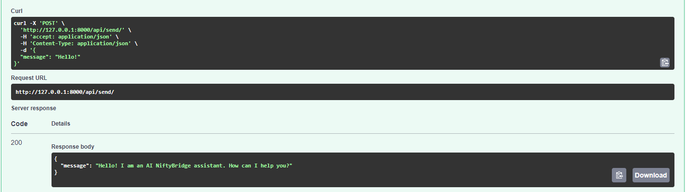

# nifty-bridge-ai-assistant

The FastAPI project is designed to connect to the Langchain library for working with Language Model (LLM) and interact with the OpenAI GPT-3.5-turbo model. 
The AI assistant is integrated with a REST API protected by an API key and is capable of answering queries related to the Nifty Bridge.


## Installation 

These instructions will get you a copy of the project up and running on your local machine for development and testing purposes. See deployment for notes on how to deploy the project on a live system.

A step by step series of examples that tell you how to get a development env running

### Installing using GitHub
Ensure Python 3.7+ is installed. Follow these steps:

```shell
git clone https://github.com/katryana/nifty-bridge-ai-assistant
cd nifty-bridge-ai-assistant
python -m venv venv
venv\Scripts\activate (on Windows)
source venv/bin/activate (on macOS)
pip install -r requirements.txt
```
You should:
* Create a .env file in the project root, similar to .env.example, and fill in your data.
* Create pinecone storage by running code in ```chatbot.knowledge_database.vector_database```

* Run server:

```shell
uvicorn main:app --reload
```
### Installing using Docker
Ensure Docker is installed. Follow these steps:

```shell
docker build -t nifty-bridge-ai-assistant .
docker run -p 8001:8000 nifty-bridge-ai-assistant
```


## Features

* Langchain Integration with GPT-3.5-turbo
* PDF Parsing, Embeddings and Vectorstore
* FastAPI REST API Interface
* Documentation is located at /docs/


## Demo

Here you can find image of trying out the endpoint:

